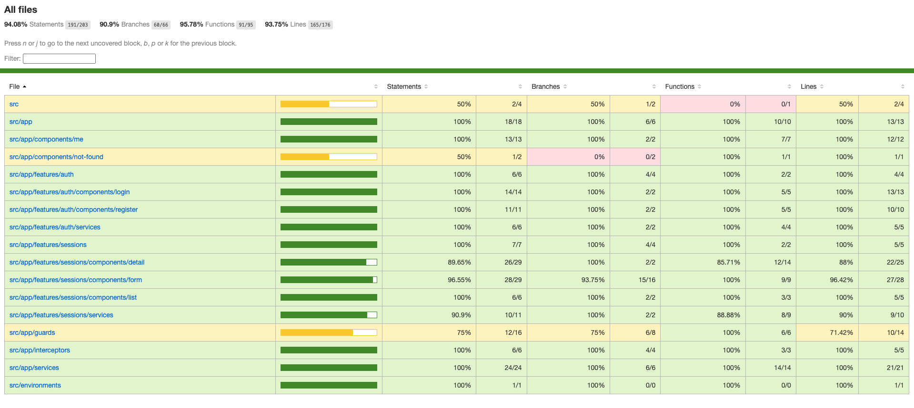

# Yoga App

## Start the Project

Clone the repository:
```bash
git clone https://github.com/clarabernadou/Clara_Bernadou_P4_NumDev_042024.git
```

### Frontend

Navigate to the frontend directory:
```bash
cd front
```

Install dependencies:
```bash
npm install
```

Launch the frontend:
```bash
npm run start
```

### Backend

Navigate to the backend directory:
```bash
cd back
```

Install dependencies:
```bash
mvn clean install
```

Create Maven configuration:


### Database

Create the MYSQL database in the terminal:
```sql
CREATE DATABASE <NAME>;
USE <NAME>;
```

An SQL script for creating the schema is available at `resources/sql/script.sql`.

Edit the `application.properties` file located at `back/src/main/resources/application.properties`:
- Replace `${DB_URL}` with your database URL.
- Replace `${DB_NAME}` with your database username.
- Replace `${DB_PASSWORD}` with your database password.

By default, the admin account is:
- **Login**: yoga@studio.com
- **Password**: test!1234

## Tests

### Frontend with Jest

Navigate to the frontend directory:
```bash
cd front
```

Run the tests:
```bash
npm run test
```

View the coverage report:


### Frontend with Cypress

Navigate to the frontend directory:
```bash
cd front
```

Run the end-to-end tests:
```bash
npm run e2e
```

Generate the coverage report (ensure end-to-end tests have been run first):
```bash
npm run e2e:coverage
```

The report is available at:
`front/coverage/lcov-report/index.html`

View the coverage report:


### Backend with JUnit

Navigate to the backend directory:
```bash
cd back
```

Launch the backend:
Run:
```bash
yoga-app [spring-boot:run]
```

Open the coverage report in your browser:
`back/target/jacoco/index.html`

View the coverage report:
